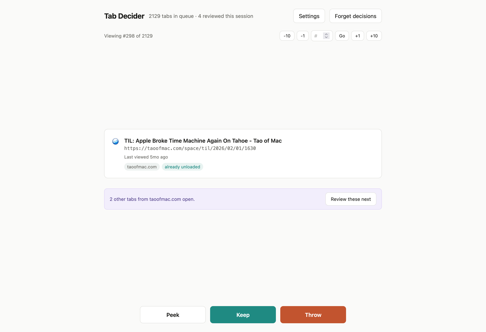

# Tab Decider

[](https://addons.mozilla.org/en-US/firefox/addon/tab-decider/)
<a href="https://madebyhuman.iamjarl.com"></a>

> Step through your open tabs one at a time: keep (unload) or throw (close).



Built for the case where you have hundreds or thousands of tabs open and no realistic way to work through them. Tab Decider shows you one tab at a time, oldest-viewed first, and asks a single question: keep it or throw it?

Keeping a tab unloads it from memory but leaves it open, so it stops consuming RAM until you visit it again. Throwing it closes it.

## Features

- Review one tab at a time, sorted oldest-viewed-first by default
- Peek at a tab to take a closer look, then decide with a keyboard shortcut without leaving it
- Undo, which reopens closed tabs through Firefox's session history and restores the one you were reviewing to your current position
- A live panel listing other open tabs with the same URL, so you can close a selected few or throw them all together. Tabs you've already kept are left alone
- Domain grouping, showing how many other open tabs share the current domain and letting you pull them to the front of the queue
- Repository grouping for GitHub, GitLab and Codeberg, so issues and pull requests from one project can be reviewed together. Grouping applies at the `owner/repo` level only, and same-named repos on different hosts stay separate
- A filter that narrows the queue by title or URL, turning the position counter into "#3 of 47 matching"
- Free navigation: step back or forward by 1 or 10, or jump to any position. Skipped tabs stay in the queue
- Running counts of tabs reviewed and duplicates closed, plus an end-of-session summary
- A second click required for anything closing more than five tabs at once, and for "Forget decisions"
- Settings for including pinned tabs and choosing between oldest-viewed-first and tab order
- Session-scoped state: the queue and history are forgotten on browser restart, by design
- Full keyboard control, screen-reader announcements, WCAG 2.1 AA contrast in both themes, and support for reduced-motion and forced-colors
- Dark mode following system appearance

## Requirements

Firefox 115 or later.

## Installation

Install from [addons.mozilla.org](https://addons.mozilla.org/en-US/firefox/addon/tab-decider/).

To run from source, load `manifest.json` as a temporary add-on via `about:debugging`.

## Usage

1. Click the **Tab Decider** toolbar icon, or press `Alt`+`Shift`+`D`.
2. The decider opens with your least-recently-used tab first.
3. Peek at the tab if you need a closer look, then press `Alt`+`Shift`+`K`/`T` to decide from there. You'll land back on the decider automatically.
4. Or click **Keep** (unloads it) or **Throw** (closes it) directly.
5. Skip around the queue freely. You don't have to decide in order.
6. Changed your mind? Undo appears after any close.

### Keyboard shortcuts

Global, working from any tab including while peeking:

| Action                   | Shortcut          |
| ------------------------ | ----------------- |
| Open / focus Tab Decider | `Alt`+`Shift`+`D` |
| Keep current tab         | `Alt`+`Shift`+`K` |
| Throw current tab        | `Alt`+`Shift`+`T` |

On the decider page:

| Action                | Key                    |
| --------------------- | ---------------------- |
| Keep (unload)         | `Enter`                |
| Throw (close)         | `x`                    |
| Peek at this tab      | `p`                    |
| Skip / back 1         | `Right` / `Left`       |
| Skip / back 10        | `Shift`+`Right`/`Left` |
| Undo last close       | `u`                    |
| Focus the filter      | `/`                    |
| Clear filter / cancel | `Esc`                  |

Global shortcuts can be rebound in `about:addons` under "Manage Extension Shortcuts". The settings panel always lists your current bindings.

## Permissions

| Permission | Reason                                                                       |
| ---------- | ---------------------------------------------------------------------------- |
| `tabs`     | Read tab metadata: URL, title, last accessed time, pinned and discarded state |
| `storage`  | Persist the review queue, cursor position, and user settings                  |
| `sessions` | Reopen closed tabs for the undo feature                                       |

## Privacy

Everything stays on your machine. No data is collected, transmitted, or shared. See [PRIVACY.md](PRIVACY.md).

## Development

```
tab-decider/
├── manifest.json
├── background.js     # Toolbar action, global shortcuts, queue integrity on external tab close
├── decider.html      # Decider UI
├── decider.js        # Queue, decisions, duplicates, grouping, filter, undo, rendering
├── decider.css       # Styles (light + dark)
└── icons/
    ├── icon-48.png
    └── icon-96.png
```

Plain HTML, CSS and JavaScript with no build step, dependencies or frameworks. Edit and reload.

## License

Apache License 2.0
